# Citizen Development Starter

A governed hub-and-spoke platform for creating short-lived citizen-development projects. It gives builders approved application templates and automated deployment while platform administrators retain control of identity, infrastructure, security, and cleanup.

## Enabling citizen development

The platform lets citizen developers focus on solving business problems while security, governance, and standardization are applied across three layers:

- **Coding agent:** Guides development toward approved patterns, templates, and project workflows.
- **Governance platform:** Controls provisioning, identity, access, repository policy, ownership, and lifecycle management.
- **Cloud host:** Runs applications within managed Azure or Microsoft Fabric boundaries using standardized infrastructure and security controls.

Together, these layers provide builders with a fast, consistent path from idea to deployed application without requiring them to become cloud or security specialists.

### GitHub Copilot as the citizen developer experience

Citizen developers can use the GitHub Copilot app as the primary conversational surface for the platform. They describe what they want to create or change in natural language, and Copilot uses the project skills and approved workflows to provision, update, or retire the application. This gives builders an approachable experience while keeping source control, deployment, identity, policy, and cloud resources inside the governed platform.

## How it works

1. A builder requests a project through a GitHub issue in the central hub.
2. GitHub Actions creates a repository from an approved template.
3. The hub provisions a dedicated identity, resource group, access controls, and deployment settings.
4. The template deploys the application to Azure or Microsoft Fabric.
5. The original issue tracks the project lifecycle; closing it or reaching the expiry period triggers cleanup.

Generated projects are isolated, use passwordless workload identity federation, and expire after seven days by default.

## Repository layout

| Path | Purpose |
| --- | --- |
| [`hub/`](hub/) | GitHub issue forms, provisioning workflows, shared Azure infrastructure, and lifecycle automation. |
| [`templates/`](templates/) | Azure and Rayfin starter applications copied into generated repositories. |
| [`skills/`](skills/) | Agent skills for creating, updating, and deleting managed projects. |
| [`docs/`](docs/) | Platform overview, setup instructions, and template guidance. |
| [`diagrams/`](diagrams/) | Detailed architecture, security, provisioning, runtime, and lifecycle diagrams. |

## Getting started

Platform setup requires an Azure subscription, a GitHub organization, and—for Rayfin projects—a Microsoft Fabric capacity and workspace.

1. Review the [platform overview](docs/overview.md).
2. Follow the [setup guide](docs/setup.md) to configure Azure, Fabric, GitHub, and the hub repository.
3. Publish each directory under [`templates/`](templates/) as an approved GitHub template repository.
4. Use the hub issue forms to provision a project.

See the [template guide](docs/templates.md) to add or maintain project types.

## Architecture

Start with the [system context](diagrams/01-system-context.md), or browse the complete [architecture diagram set](diagrams/README.md). Presentation-ready SVGs are also available in [`diagrams/slide-ready/`](diagrams/slide-ready/).

## License

See [LICENSE](LICENSE).
