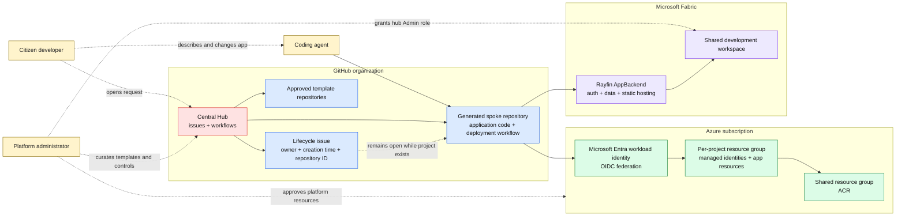

# 1. System context

This is the highest-level view of the governed citizen-development platform.

## Key points

1. Users request projects through central-hub issue forms; they do not create governed repositories or cloud resources directly.
2. The hub creates a repository from an approved template and configures its identity, variables, restrictions, and initial deployment.
3. Azure projects run in Azure Container Apps and use a shared Azure Container Registry with repository-scoped permissions.
4. Rayfin projects deploy into a shared Fabric development workspace using a dedicated per-repository identity.
5. The open provisioning issue is both the audit record and lifecycle switch. Closing it requests deletion.

## Evidence

- [Platform overview](../docs/overview.md)
- [Central Hub README](../hub/README.md)
- [Setup guide](../docs/setup.md)
