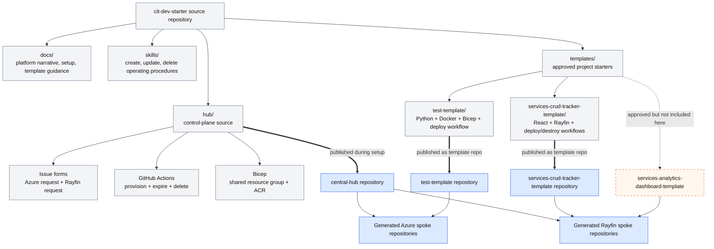

# 2. Repository blueprint

The checked-in repository packages the documentation, control plane, project templates, and agent-facing operating procedures needed to establish the platform.

## What each area owns

| Area | Responsibility |
| --- | --- |
| `docs/` | Platform rationale, administrator setup, and template conventions. |
| `skills/` | Safe agent procedures for project creation, bounded updates, and destructive retirement. |
| `hub/` | GitHub issue intake, validation, repository creation, cloud identity provisioning, expiry, and deletion. |
| `templates/test-template/` | Minimal Azure-hosted Python service and its container/infrastructure deployment path. |
| `templates/services-crud-tracker-template/` | Fabric-hosted React CRUD application, Rayfin schema, auth, deployment, and destruction. |

## Evidence

- [Setup guide](../docs/setup.md)
- [Template guidance](../docs/templates.md)
- [Central Hub structure](../hub/README.md)
