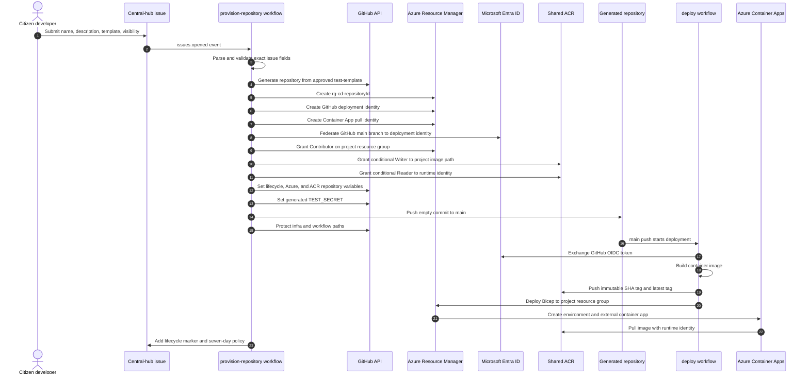

# 3. Azure project provisioning

This sequence follows the implemented `[Create repository]` workflow from request to initial deployment.

## Provisioned Azure resources and controls

- Resource group: `rg-cd-<repository-id>`.
- Deployment identity: `id-gh-<repository-id>`, federated only to the generated repository's `main` branch.
- Runtime image-pull identity: `id-aca-<repository-id>`.
- ACR image path: `citizen-dev/<lowercase-repository-name>`.
- Repository ruleset: prevents changes to `infra/**/*` and `.github/workflows/**/*`.
- Container App: external ingress on port `8000`, single active revision, `0-3` replicas.

## Failure behavior

Validation or provisioning failures produce an issue comment linking to the failed workflow. The workflow does not report a success-shaped fallback.

## Evidence

- [Azure issue form](../hub/.github/ISSUE_TEMPLATE/create-repository.yml)
- [Azure provisioning workflow](../hub/.github/workflows/provision-repository.yml)
- [Azure deployment workflow](../templates/test-template/.github/workflows/deploy.yml)
- [Container App Bicep](../templates/test-template/infra/resources.bicep)
