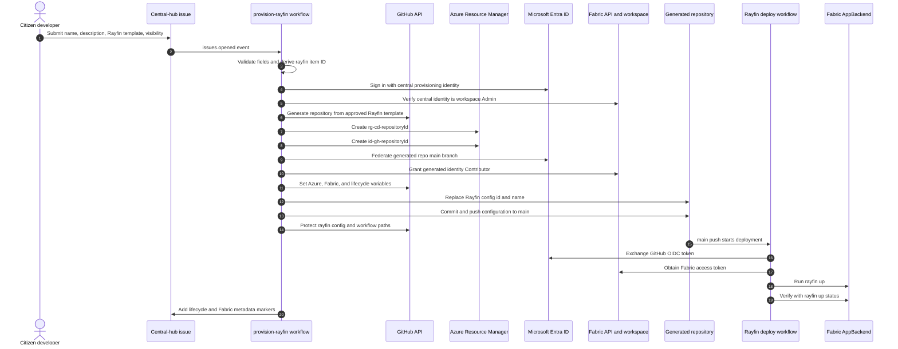

# 4. Rayfin project provisioning

This sequence follows the implemented `[Provision Rayfin]` workflow into the shared Fabric development workspace.

For presentation use, see the [simplified SVG](04-rayfin-project-provisioning-simple.svg) and its [Mermaid source](04-rayfin-project-provisioning-simple.mmd).

## Provisioned resources and controls

- Resource group: `rg-cd-<repository-id>`.
- Deployment identity: `id-gh-<repository-id>`.
- Fabric role: `Contributor` in the configured shared development workspace.
- Rayfin item ID: normalized `rayfin-<repository-name>-<issue-number>`, capped at 63 characters.
- Repository ruleset: prevents changes to `rayfin/rayfin.yml` and `.github/workflows/**/*`.
- Supported templates: analytics dashboard and CRUD tracker.

## Separation of authority

The central provisioning identity must be a Fabric workspace `Admin` so it can grant access. The generated repository identity receives only `Contributor`, which is used by the template's deployment workflow.

## Evidence

- [Rayfin issue form](../hub/.github/ISSUE_TEMPLATE/provision-rayfin.yml)
- [Rayfin provisioning workflow](../hub/.github/workflows/provision-rayfin.yml)
- [CRUD template deployment workflow](../templates/services-crud-tracker-template/.github/workflows/deploy.yml)
