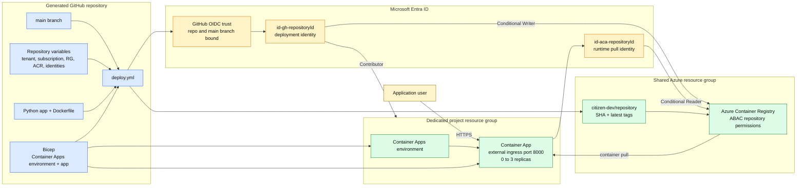

# 5. Azure spoke runtime

The Azure template separates deployment authority from runtime image-pull authority.

## Build and deployment path

1. A push to `main` starts the template's workflow.
2. Docker builds the dependency-free Python HTTP service.
3. GitHub Actions authenticates without a client secret by exchanging its OIDC token.
4. The workflow pushes both a commit-SHA tag and `latest` into the project's ACR repository path.
5. Bicep creates or updates the Container Apps environment and application.
6. The running Container App pulls the image using a different identity from the deployment identity.

## Runtime characteristics

- Non-root container user with UID `10001`.
- Python standard-library server on port `8000`.
- Public Container App ingress.
- Minimum replicas `0`; maximum replicas `3`.
- Shared ACR, but conditional role assignments limit both identities to one image repository path.

## Evidence

- [Dockerfile](../templates/test-template/Dockerfile)
- [Application](../templates/test-template/app.py)
- [Deployment workflow](../templates/test-template/.github/workflows/deploy.yml)
- [Container App resources](../templates/test-template/infra/resources.bicep)
- [Azure provisioning workflow](../hub/.github/workflows/provision-repository.yml)
