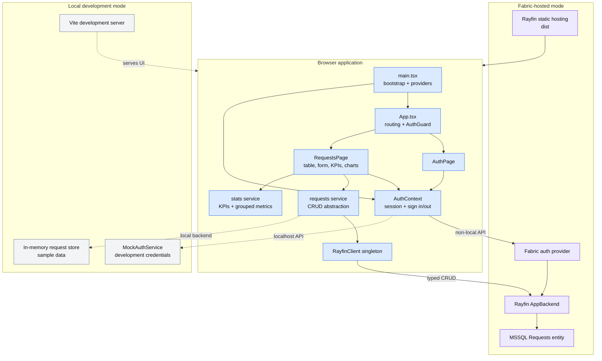

# 6. Rayfin CRUD tracker template

The CRUD tracker is a React/Vite frontend backed by Rayfin authentication, SQL data services, and static hosting in Microsoft Fabric. Local development substitutes mock authentication and in-memory data.

## Application flow

1. `main.tsx` bootstraps authentication, then mounts the auth provider and error boundary.
2. `AuthGuard` holds protected routes until session resolution finishes.
3. `RequestsPage` loads data, seeds sample rows when the real backend is empty, and drives create/read/update/delete operations.
4. The statistics service computes KPIs, counts by team, and estimated hours by status for the dashboard.
5. The Rayfin schema defines one `Requests` entity with UUID, text, integer, and date fields.

## Production versus local development

| Concern | Production/Fabric | Local development |
| --- | --- | --- |
| Authentication | Fabric auth provider, embedded or interactive sign-in | Mock auth service |
| Data | Typed Rayfin client to MSSQL-backed entity | In-memory store |
| Hosting | Rayfin static hosting from built `dist` | Vite development server |
| Seeding | Insert samples once when the backend is empty | Start from bundled sample data |

## Deployment services

The Rayfin configuration enables authentication, data with the `mssql` dialect, and static hosting. Storage and functions are disabled. The GitHub deployment workflow runs `rayfin up` and then verifies status.

## Evidence

- [Template README](../templates/services-crud-tracker-template/README.md)
- [Application entry point](../templates/services-crud-tracker-template/src/main.tsx)
- [Router](../templates/services-crud-tracker-template/src/App.tsx)
- [Authentication context](../templates/services-crud-tracker-template/src/hooks/AuthContext.tsx)
- [CRUD service](../templates/services-crud-tracker-template/src/services/requests.ts)
- [Statistics service](../templates/services-crud-tracker-template/src/services/stats.ts)
- [Rayfin entity](../templates/services-crud-tracker-template/rayfin/data/Requests.ts)
- [Rayfin service configuration](../templates/services-crud-tracker-template/rayfin/rayfin.yml)
