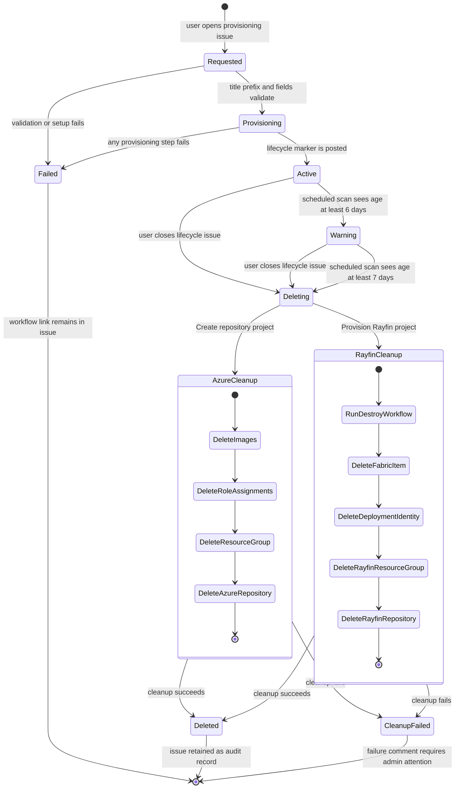

# 7. Lifecycle and cleanup

Azure and Rayfin projects use the same issue-driven state model, with type-specific cleanup operations.

## Lifecycle record

The bot success comment contains a hidden marker with:

- full repository name;
- immutable GitHub repository ID; and
- UTC creation timestamp.

Rayfin success comments add the Fabric workspace ID and role-assignment ID. Expiry and deletion workflows resolve the managed repository from these markers rather than trusting only the issue title.

## Scheduling

- Azure expiry scan: daily at `09:17 UTC`.
- Rayfin expiry scan: daily at `09:27 UTC`.
- At six days: add one warning comment.
- At seven days: dispatch the matching delete workflow with reason `expired`.
- At any time: closing the lifecycle issue starts type-specific deletion.

## Destructive safety checks

- Reject issues with the wrong title prefix.
- Require a lifecycle marker posted by `github-actions[bot]`.
- Refuse repositories outside `citizen-dev-proserv`.
- Refuse deletion of the central hub itself.
- Resolve the current repository by immutable repository ID immediately before deletion.
- Treat already-missing resources as idempotent success only where the workflow explicitly verifies that condition.

## Evidence

- [Azure expiry workflow](../hub/.github/workflows/expire-repositories.yml)
- [Rayfin expiry workflow](../hub/.github/workflows/expire-rayfin.yml)
- [Azure deletion workflow](../hub/.github/workflows/delete-repository.yml)
- [Rayfin deletion workflow](../hub/.github/workflows/delete-rayfin.yml)
- [Deletion operating procedure](../skills/delete-project/SKILL.md)
