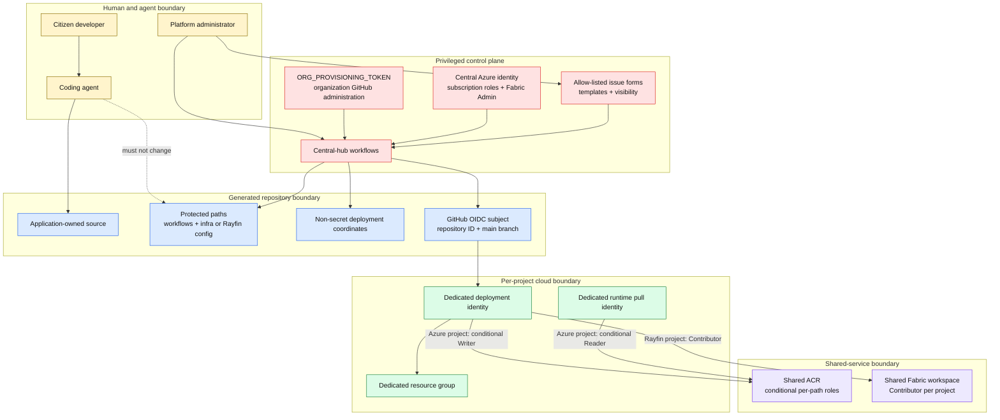

# 8. Security and trust boundaries

The primary security pattern is central bootstrap authority followed by per-project, secretless workload identities with narrower scopes.

## Security controls by stage

| Stage | Control |
| --- | --- |
| Request | Exact field parsing, repository-name regex, allow-listed visibility, and allow-listed templates. |
| Repository creation | Repositories are initially private; only explicit `internal` requests are widened. Public is not accepted. |
| Authentication | GitHub Actions uses OIDC federation rather than stored Azure client secrets. |
| Identity binding | Federated subject includes organization ID, repository ID, repository name, and `refs/heads/main`. |
| Azure authorization | Deployment identity is Contributor only on its resource group. |
| Shared registry | ABAC conditions restrict Writer and Reader roles to one image repository path. |
| Fabric authorization | Generated Rayfin identity is Contributor, while central provisioning retains Admin. |
| Source protection | Active rulesets restrict centrally managed workflows and infrastructure/configuration paths. |
| Retirement | Lifecycle marker, organization checks, repository-ID lookup, and separate type-specific cleanup. |

## Privileged configuration

The central hub depends on:

- `ORG_PROVISIONING_TOKEN` for organization-level GitHub operations;
- `TEMPLATE_RAYFIN_WORKSPACE_ID` for the target Fabric workspace;
- Azure tenant, subscription, location, client ID, and shared-resource-group variables; and
- a central managed identity with sufficient Azure and Fabric authority.

These controls make central-hub administration the highest-trust boundary. Template and workflow changes therefore require platform-administrator review.

## Evidence

- [Setup guide](../docs/setup.md)
- [Azure provisioning workflow](../hub/.github/workflows/provision-repository.yml)
- [Rayfin provisioning workflow](../hub/.github/workflows/provision-rayfin.yml)
- [Update operating procedure](../skills/update-project/SKILL.md)
