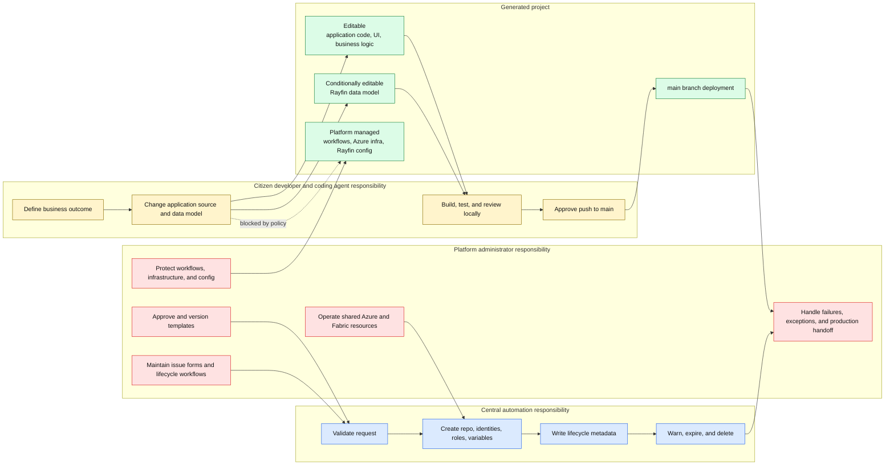
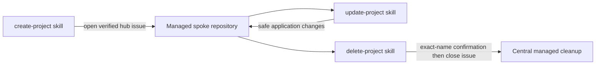

# 9. Responsibilities and change flow

Governance works by splitting platform-owned controls from application-owned behavior.

## Change rules

- Citizen developers own application behavior inside a generated spoke.
- Azure `infra/**` and all `.github/workflows/**` are centrally managed and must not be modified in a generated project.
- Rayfin `rayfin/rayfin.yml` is centrally managed; `rayfin/data/**` may change when the application needs a schema change.
- Local edits and validation are reversible. Pushing to `main` can deploy immediately and requires explicit user approval under the update procedure.
- Central Hub owns provisioning, expiry, and deletion. It has no application-update workflow.
- Production-like use, long-term ownership, and exceptions require explicit platform-administrator handoff rather than bypassing controls.

## Agent-facing lifecycle

## Evidence

- [Create project procedure](../skills/create-project/SKILL.md)
- [Update project procedure](../skills/update-project/SKILL.md)
- [Delete project procedure](../skills/delete-project/SKILL.md)
- [Template guidance](../docs/templates.md)
