# 10. Associated resources and dependencies

This map separates resources contained in the repository from systems and repositories it expects to exist around it.

```mermaid
flowchart TB
    Starter["citizen-dev-proserv/cit-dev-starter<br/>verified public source distribution"]

    subgraph IntendedRepos["Intended operational repositories"]
        HubRepo["citizen-dev-proserv/central-hub<br/>referenced, not publicly resolvable"]
        AzureTemplate["citizen-dev-proserv/test-template<br/>referenced, not publicly resolvable"]
        CrudTemplate["citizen-dev-proserv/services-crud-tracker-template<br/>referenced, not publicly resolvable"]
        AnalyticsTemplate["citizen-dev-proserv/services-analytics-dashboard-template<br/>referenced, not publicly resolvable"]
    end

    subgraph Upstream["Verified public upstream resources"]
        Awesome["microsoft/awesome-rayfin<br/>Rayfin gallery and documentation"]
        Gallery["memasanz/mm-rayfin-templates<br/>source gallery linked by CRUD template"]
        AzureLogin["Azure/login GitHub Action"]
        Checkout["actions/checkout GitHub Action"]
        SetupNode["actions/setup-node GitHub Action"]
        Python["python:3.13-slim container image"]
    end

    subgraph Endpoints["Service endpoints and package infrastructure"]
        OIDC["token.actions.githubusercontent.com<br/>GitHub OIDC issuer"]
        FabricAPI["api.fabric.microsoft.com<br/>Fabric OAuth audience and REST API"]
        PackageFeed["packagefeedproxy.microsoft.io/npm<br/>Microsoft npm scope feed"]
        RegionDocs["Fabric region availability<br/>deployment constraint"]
    end

    subgraph Prerequisites["Administrator-provisioned prerequisites"]
        Subscription["Azure subscription"]
        SharedRG["Shared Azure resource group"]
        ACR["Single shared ACR"]
        HubIdentity["Central managed identity"]
        Capacity["Fabric capacity"]
        Workspace["Fabric development workspace"]
        PAT["Fine-grained GitHub PAT"]
    end

    Starter -->|"setup publishes"| HubRepo
    Starter -->|"setup publishes"| AzureTemplate
    Starter -->|"setup publishes"| CrudTemplate
    Starter -. "issue form references" .-> AnalyticsTemplate
    CrudTemplate --> Gallery
    CrudTemplate --> Awesome
    HubRepo --> AzureLogin
    AzureTemplate --> AzureLogin
    CrudTemplate --> AzureLogin
    AzureTemplate --> Checkout
    CrudTemplate --> Checkout
    CrudTemplate --> SetupNode
    AzureTemplate --> Python
    CrudTemplate --> PackageFeed
    HubRepo --> OIDC
    AzureTemplate --> OIDC
    CrudTemplate --> OIDC
    HubRepo --> FabricAPI
    CrudTemplate --> FabricAPI
    Capacity --> Workspace
    RegionDocs -. "constrains location" .-> Capacity
    Subscription --> SharedRG
    SharedRG --> ACR
    HubIdentity --> Subscription
    HubIdentity --> Workspace
    PAT --> HubRepo

    classDef starter fill:#f3f4f6,stroke:#64748b,color:#111;
    classDef intended fill:#fff7ed,stroke:#ea580c,color:#111,stroke-dasharray:5 5;
    classDef upstream fill:#dbeafe,stroke:#2563eb,color:#111;
    classDef endpoint fill:#ede9fe,stroke:#7c3aed,color:#111;
    classDef prereq fill:#dcfce7,stroke:#16803a,color:#111;
    class Starter starter;
    class HubRepo,AzureTemplate,CrudTemplate,AnalyticsTemplate intended;
    class Awesome,Gallery,AzureLogin,Checkout,SetupNode,Python upstream;
    class OIDC,FabricAPI,PackageFeed,RegionDocs endpoint;
    class Subscription,SharedRG,ACR,HubIdentity,Capacity,Workspace,PAT prereq;
```

## External inventory

| Resource | Purpose | Verification status |
| --- | --- | --- |
| [cit-dev-starter](https://github.com/citizen-dev-proserv/cit-dev-starter) | Public distribution repository represented by this working tree. | Public and verified. |
| `citizen-dev-proserv/central-hub` | Intended deployed issue-driven control plane. | Referenced, but public API returned `404`. |
| `citizen-dev-proserv/test-template` | Intended approved Azure template repository. | Referenced, but public API returned `404`. |
| `citizen-dev-proserv/services-crud-tracker-template` | Intended approved Rayfin CRUD template repository. | Referenced, but public API returned `404`. |
| `citizen-dev-proserv/services-analytics-dashboard-template` | Intended approved read-only Rayfin template. | Referenced, but public API returned `404`; source is not included here. |
| [microsoft/awesome-rayfin](https://github.com/microsoft/awesome-rayfin) | Public Rayfin gallery and package overview. | Public and verified. |
| [memasanz/mm-rayfin-templates](https://github.com/memasanz/mm-rayfin-templates) | Public gallery directly linked by the bundled CRUD template. | Public and verified. |
| [Azure/login](https://github.com/Azure/login) | GitHub OIDC authentication to Azure. | Used as major versions `v2` and `v3`. |
| [actions/checkout](https://github.com/actions/checkout) | Workflow source checkout. | Used as `v4`. |
| [actions/setup-node](https://github.com/actions/setup-node) | Node.js setup for Rayfin workflows. | Used as `v4`. |
| [Microsoft Fabric API](https://api.fabric.microsoft.com) | Workspace roles, Fabric tokens, AppBackend deployment and deletion. | Endpoint is embedded in workflows. |
| [GitHub Actions OIDC issuer](https://token.actions.githubusercontent.com) | Workload identity issuer for each generated repository. | Issuer is embedded in federation setup. |
| [Microsoft package feed proxy](https://packagefeedproxy.microsoft.io/npm/) | Package source for the `@microsoft` npm scope. | Configured in the CRUD template. |
| [Fabric region availability](https://learn.microsoft.com/en-us/fabric/admin/region-availability) | Determines where Fabric Apps can be used. | Linked by the setup guide. |

## Operational caveats

1. A public `404` does not prove that a referenced repository is absent; it may be private or internal.
2. The repository-root Actions API exposes only GitHub-managed dynamic CodeQL and Dependency Graph workflows. The checked-in hub/template workflows become active only after those directories are published as their intended repositories.
3. No concrete Azure subscription, tenant, ACR, Fabric workspace, or deployed-spoke identifiers are public. All diagrams therefore show parameterized resources.
4. GitHub Actions are referenced by mutable major-version tags rather than immutable commit SHAs.
5. The setup guide recommends GitHub Environments for production, but the implementation binds federation directly to `main` and declares no Actions environment.

## Evidence

- [Setup guide](../docs/setup.md)
- [Create project procedure](../skills/create-project/SKILL.md)
- [Hub shared infrastructure](../hub/infra/main.bicep)
- [Hub ACR module](../hub/infra/modules/container-registry.bicep)
- [CRUD template package manifest](../templates/services-crud-tracker-template/package.json)
- [CRUD template npm configuration](../templates/services-crud-tracker-template/.npmrc)
- [CRUD template MCP configuration](../templates/services-crud-tracker-template/.mcp.json)
